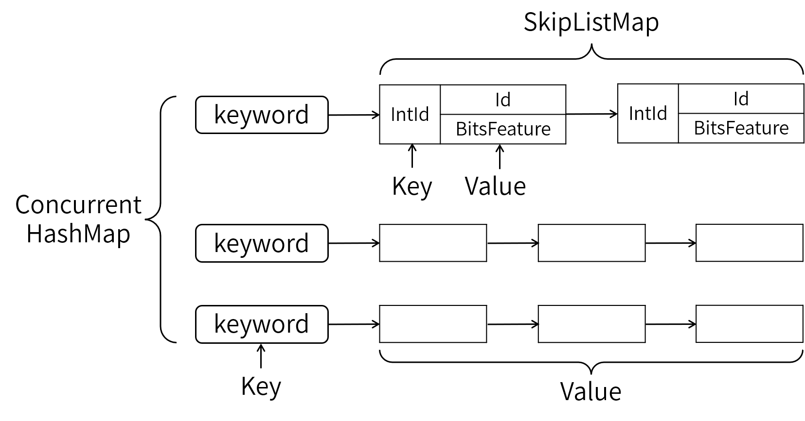

# github.com/WlayRay/ElectricSearch/v1.0.0索引框架

纯go语言实现的搜索引擎索引框架，支持单机部署，分布式部署（分布式部署需要etcd作为服务注册中心）

## 项目架构

### 倒排索引

    

- 倒排索引的整体架构由自行实现的[ConcurrentHashMap](util/concurrent_hash_map.go)和SkipList实现，ConcurrentHashMap较支持并发读写，且较sync.map性能更好。
- IntId是使用[雪花算法](util/snowflake.go)给document生成的自增id，用于SkipList的排序。
- Id是document在业务侧的ID。
- BitsFeature是uint64，可以把document的属性编码成bit流，遍历倒排索引的同时完成部分筛选功能。

### 正排索引

支持badger和bolt两种数据库存储document的详情。

### 分布式索引

document数量过大，单机容不下时，可以将document分散存储在多台服务器上。各索引服务器之间通过grpc通信，通过etcd实现服务注册与发现。

  

- 由多个Group垂直切分整个倒排索引，每个Group内有多台worker做冗余备份
- worker(Group)之间通过etcd感知彼此的存在，并使用grpc通信
- 在[hub_proxy](service/hub_proxy.go)中使用代理模式缓存etcd的中的服务地址，并对etcd做限流保护

## 示例教程

敬请期待
